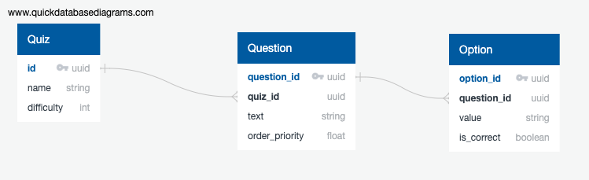

# Quizzly Backend

A RESTful API for the Quizzly app built using Node.js + Express.js and a PostgreSQL database. It supports full CRUD with respect to quizzes, questions and options. Examples of common requests to the API can be found in `Quizzly_API_Routes.postman_collection.json`

## Built With

- [Node.js](https://nodejs.org/en/) - The JavaScript Runtime
- [Express.js](https://expressjs.com/) - The Web Framework
- [JSONschema](https://jsonschema.net/home) - Request Schema Validation
- [PostgreSQL](https://www.postgresql.org/) - The Relational Database

## Database Design

## Notable Design Choices

Quizzes -> Questions -> Options were simplified to fall into a clean hierachical one-to-many relationship. In reality questions could have a many-to-many relationship with quizzes, as the same question prompt could for example appear in both "Section 1.1 Quiz" and "Section 1 Cumulative Quiz". As such there could be some degree of duplicated effort in the database as the volume of quizzes/questions gets large.

Each question has an associated floating point "order priority" that determines its question order in the quiz. The inspiration for this was drawn from the priority associated with items in a priority queue. Several alternative implementations to tackle question ordering, including:

- Hard-coded integer "question numbers" attached to questions. This would have introduced issues when trying to delete or modify the order of questions.
- An separate table that pairs a quiz ID with a fixed ordered list of question IDs "question order". This would have ended up with many more queries to the database any time a value needed to be updated or retrieved.

The choice of UUIDs over serial integers to uniquely identify quizzes, questions and options had two main motivations. First, the frontend would eventually needs to incorporate unique resource identifiers into the structure of its URLs, and UUIDs offer a way to do they without exposing excess information. Second, UUIDs simplify insuring that there are no collisions when inserting and deleting resources into the database for testing purposes.

JSONschema is used to validate inputs for POST/PATCH requests. This adds a bit of overhead but would hopefully result in more consistent performance if the application were to scale up. As there was a lot of duplication in the schema validation of the request body, this was extracted into a middleware thunk.

The application notably lacks a model layer. The data necessary for the frontend is straightforward enough that a data access layer sufficed. Should the application be expanded in scope in the future, a model layer could be installed on top of the data access layer.

As the scope of the application is relatively narrow, the focus of testing is upon integration testing.

## Future Areas of Improvement

- Expand quiz-question and question-option relationships to be many-to-many
- Add authorship to quizzes. This could include the ability to filter by quizzes by author.
- Permanent incorporation of users as a table the database. This would allow tracking of user metrics to display things such as a leaderboard to users on the frontend.
